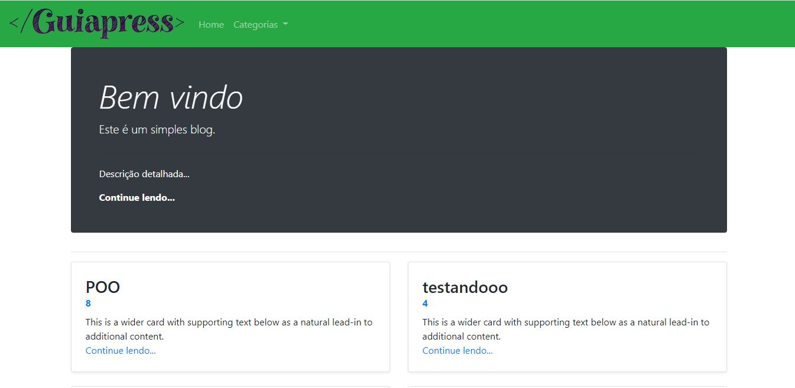
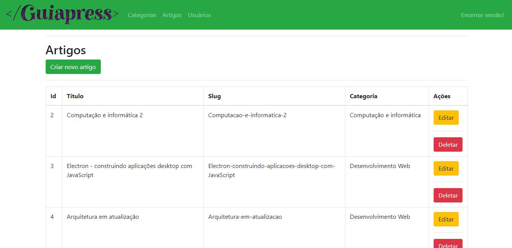
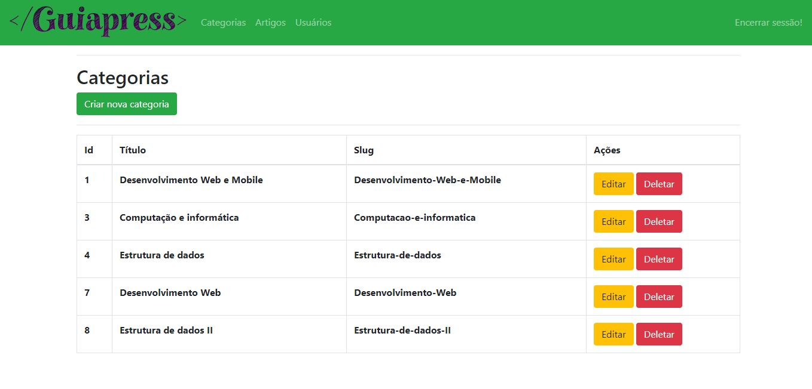
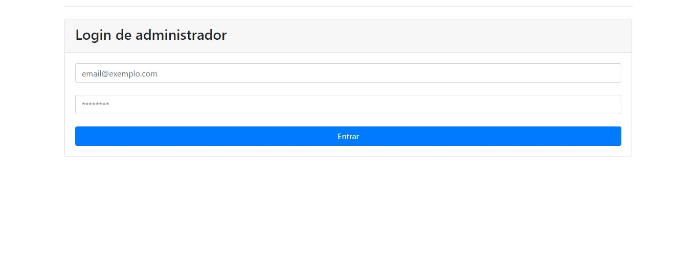
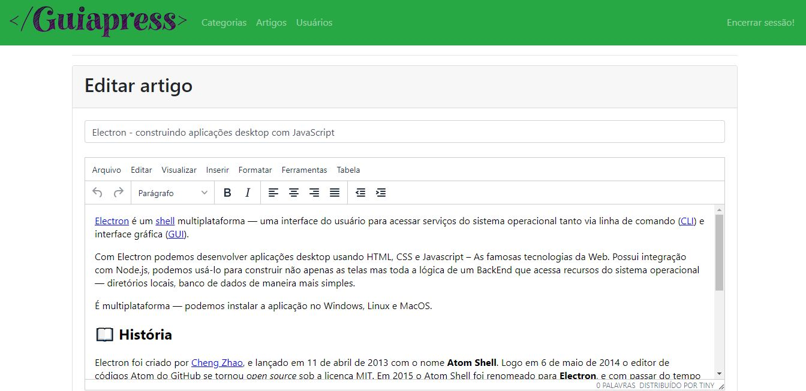

<p align="center" >
    
</p>


## Descrição do projeto:

<p> O Guiapress é um blog simples contruido em NodeJs integrado com TinyMce, que é um editor de texto online muito versátil.</p>
<p> Com ele é possível publicar e editar artigos e criar novas categorias, contanto que esteja autenticado no painel admin</p>
<p> Foi utilizado o sistema de "hash" com a biblioteca 'bcryptjs', possibilitando um login seguro para os usuários.</p>


## Screens

- Home
    

- Articles
    

- Categories
    

- Administrator login
    

- Editing articles
    


## Tecnologias:

- NodeJs
- Mysql
- Bootstrap
- Tinymce
- bcryptjs

# :construction_worker: Como rodar
```bash
# Clone o Repositoria
$ git clone https://github.com/clebsonsantos/guiapress.git
```

### 💻 Rode o Project 

```bash
# Vá para a pasta
$ cd guiapress

# Instale as depedencias
$ npm install

# Rode a aplicação
$ npm start
```

Acesse: http://localhost:8080/ para ver o resultado.

Acesse: http://localhost:8080/login para se conectar.

Acessando a rota http://localhost/users/create é possível criar um usuário para se aprofundar no painel administrativo


Para conecção com o banco de dados foi utilizado o [Mysql Workbenck](https://dev.mysql.com/downloads/workbench/).


# :closed_book: Licença


Feito com 💙 por  [Clebson Santos](https://github.com/clebsonsantos) 🚀.
Esse projeto esta sobre [MIT license](./LICENSE).


Dê uma ⭐️ se esse projeto te ajudou!
